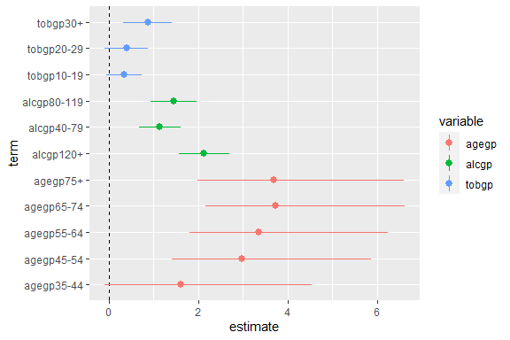
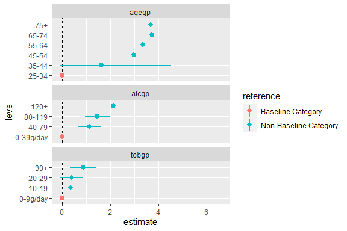

<!-- README.md is generated from README.Rmd. Please edit that file -->

## Introduction

The `tidycat` package includes the `tidy_categorical()` function to
expand `broom::tidy()` outputs for categorical parameter estimates.

<!-- badges: start -->

<!-- badges: end -->

## Installation

You can install the released version of tidycat from
[CRAN](https://CRAN.R-project.org) with:

``` r
install.packages("tidycat")
```

And the development version from [GitHub](https://github.com/) with:

``` r
# install.packages("devtools")
devtools::install_github("guyabel/tidycat")
```

## Additional columns on broom::tidy() for categorical parameter estimates

The `tidy()` function in the broom package takes the messy output of
built-in functions in R, such as `lm()`, and turns them into tidy data
frames.

``` r
library(dplyr)
library(broom)
m0 <- esoph %>%
   mutate_if(is.factor, ~factor(., ordered = FALSE)) %>%
   glm(cbind(ncases, ncontrols) ~ agegp + tobgp + alcgp, data = .,
         family = binomial())
# tidy
tidy(m0)
#> # A tibble: 12 x 5
#>    term        estimate std.error statistic  p.value
#>    <chr>          <dbl>     <dbl>     <dbl>    <dbl>
#>  1 (Intercept)   -5.91      1.03      -5.74 9.61e- 9
#>  2 agegp35-44     1.61      1.07       1.51 1.32e- 1
#>  3 agegp45-54     2.98      1.02       2.90 3.68e- 3
#>  4 agegp55-64     3.36      1.02       3.29 9.91e- 4
#>  5 agegp65-74     3.73      1.03       3.64 2.78e- 4
#>  6 agegp75+       3.68      1.06       3.46 5.43e- 4
#>  7 tobgp10-19     0.341     0.205      1.66 9.72e- 2
#>  8 tobgp20-29     0.396     0.246      1.61 1.07e- 1
#>  9 tobgp30+       0.868     0.277      3.14 1.70e- 3
#> 10 alcgp40-79     1.12      0.238      4.70 2.55e- 6
#> 11 alcgp80-119    1.45      0.263      5.51 3.68e- 8
#> 12 alcgp120+      2.12      0.288      7.36 1.90e-13
```

Note: Currently ordered factor not supported in `tidycat`, hence their
removal in `mutate_if()` above

The `tidy_categorical()` function adds further columns (`variable`,
`level` and `effect`) to tidy output to help manage categorical
variables

``` r
library(tidycat)
m0 %>%
  tidy() %>%
  tidy_categorical(m = m0)
#> # A tibble: 12 x 8
#>    term        estimate std.error statistic  p.value variable    level    effect
#>    <chr>          <dbl>     <dbl>     <dbl>    <dbl> <chr>       <fct>    <chr> 
#>  1 (Intercept)   -5.91      1.03      -5.74 9.61e- 9 (Intercept) ""       main  
#>  2 agegp35-44     1.61      1.07       1.51 1.32e- 1 agegp       "35-44"  main  
#>  3 agegp45-54     2.98      1.02       2.90 3.68e- 3 agegp       "45-54"  main  
#>  4 agegp55-64     3.36      1.02       3.29 9.91e- 4 agegp       "55-64"  main  
#>  5 agegp65-74     3.73      1.03       3.64 2.78e- 4 agegp       "65-74"  main  
#>  6 agegp75+       3.68      1.06       3.46 5.43e- 4 agegp       "75+"    main  
#>  7 tobgp10-19     0.341     0.205      1.66 9.72e- 2 tobgp       "10-19"  main  
#>  8 tobgp20-29     0.396     0.246      1.61 1.07e- 1 tobgp       "20-29"  main  
#>  9 tobgp30+       0.868     0.277      3.14 1.70e- 3 tobgp       "30+"    main  
#> 10 alcgp40-79     1.12      0.238      4.70 2.55e- 6 alcgp       "40-79"  main  
#> 11 alcgp80-119    1.45      0.263      5.51 3.68e- 8 alcgp       "80-119" main  
#> 12 alcgp120+      2.12      0.288      7.36 1.90e-13 alcgp       "120+"   main
```

Include additional rows for reference category terms and column to
indicate their location by setting `exclude_reference = FALSE` and
`reference_label` to a suitable string. Setting `exponentiate = TRUE`
ensures the parameter estimates in the reference group are set to one
instead of zero (even odds in the logistic regression example below).

``` r
m0 %>%
  tidy(exponentiate = TRUE) %>%
  tidy_categorical(m = m0, exponentiate = TRUE, 
                   exclude_reference = FALSE, reference_label = "Baseline") %>%
  select(-statistic, -p.value)
#> # A tibble: 15 x 7
#>    term        estimate std.error variable    level       effect reference   
#>    <chr>          <dbl>     <dbl> <chr>       <fct>       <chr>  <chr>       
#>  1 (Intercept)  0.00271     1.03  (Intercept) ""          main   Non-Baseline
#>  2 <NA>         1           1     agegp       "25-34"     main   Baseline    
#>  3 agegp35-44   5.00        1.07  agegp       "35-44"     main   Non-Baseline
#>  4 agegp45-54  19.6         1.02  agegp       "45-54"     main   Non-Baseline
#>  5 agegp55-64  28.7         1.02  agegp       "55-64"     main   Non-Baseline
#>  6 agegp65-74  41.6         1.03  agegp       "65-74"     main   Non-Baseline
#>  7 agegp75+    39.7         1.06  agegp       "75+"       main   Non-Baseline
#>  8 <NA>         1           1     tobgp       "0-9g/day"  main   Baseline    
#>  9 tobgp10-19   1.41        0.205 tobgp       "10-19"     main   Non-Baseline
#> 10 tobgp20-29   1.49        0.246 tobgp       "20-29"     main   Non-Baseline
#> 11 tobgp30+     2.38        0.277 tobgp       "30+"       main   Non-Baseline
#> 12 <NA>         1           1     alcgp       "0-39g/day" main   Baseline    
#> 13 alcgp40-79   3.07        0.238 alcgp       "40-79"     main   Non-Baseline
#> 14 alcgp80-119  4.25        0.263 alcgp       "80-119"    main   Non-Baseline
#> 15 alcgp120+    8.29        0.288 alcgp       "120+"      main   Non-Baseline
```

## Standard coefficient plots

The results from `broom::tidy()` can be used to quickly plot estimated
coefficients and their confidence intervals.

``` r
# store parameter estimates and confidence intervals (except for the intercept)
d0 <- m0 %>%
  tidy(conf.int = TRUE) %>%
  slice(-1)
d0
#> # A tibble: 11 x 7
#>    term        estimate std.error statistic  p.value conf.low conf.high
#>    <chr>          <dbl>     <dbl>     <dbl>    <dbl>    <dbl>     <dbl>
#>  1 agegp35-44     1.61      1.07       1.51 1.32e- 1  -0.100      4.54 
#>  2 agegp45-54     2.98      1.02       2.90 3.68e- 3   1.41       5.86 
#>  3 agegp55-64     3.36      1.02       3.29 9.91e- 4   1.81       6.24 
#>  4 agegp65-74     3.73      1.03       3.64 2.78e- 4   2.16       6.62 
#>  5 agegp75+       3.68      1.06       3.46 5.43e- 4   1.99       6.61 
#>  6 tobgp10-19     0.341     0.205      1.66 9.72e- 2  -0.0644     0.742
#>  7 tobgp20-29     0.396     0.246      1.61 1.07e- 1  -0.0935     0.872
#>  8 tobgp30+       0.868     0.277      3.14 1.70e- 3   0.319      1.41 
#>  9 alcgp40-79     1.12      0.238      4.70 2.55e- 6   0.665      1.60 
#> 10 alcgp80-119    1.45      0.263      5.51 3.68e- 8   0.939      1.97 
#> 11 alcgp120+      2.12      0.288      7.36 1.90e-13   1.56       2.69

library(ggplot2)
library(tidyr)
ggplot(data = d0,
        mapping = aes(x = term, y = estimate, ymin = conf.low, ymax = conf.high)) +
   coord_flip() +
   geom_hline(yintercept = 0, linetype = "dashed") +
   geom_pointrange()
```


## Enhanced coefficient plots

Using the additional columns from `tidy_categroical()` the coefficient
plot can be enhanced to include the reference category, allowing the
reader to better grasp the meaning of the parameter estimates in each
categorical variable. Using `ggforce::facet_col()` the terms of each
variable can be separated to further improve the presentation of the
coefficient plot.

``` r
d0 <- m0 %>%
  tidy(conf.int = TRUE) %>%
  tidy_categorical(m = m0, exclude_reference = FALSE, reference_label = "Baseline") %>%
  slice(-1)

d0 %>%
  select(-(3:5))
#> # A tibble: 14 x 8
#>    term        estimate conf.low conf.high variable level     effect reference  
#>    <chr>          <dbl>    <dbl>     <dbl> <chr>    <fct>     <chr>  <chr>      
#>  1 <NA>           0       0          0     agegp    25-34     main   Baseline   
#>  2 agegp35-44     1.61   -0.100      4.54  agegp    35-44     main   Non-Baseli~
#>  3 agegp45-54     2.98    1.41       5.86  agegp    45-54     main   Non-Baseli~
#>  4 agegp55-64     3.36    1.81       6.24  agegp    55-64     main   Non-Baseli~
#>  5 agegp65-74     3.73    2.16       6.62  agegp    65-74     main   Non-Baseli~
#>  6 agegp75+       3.68    1.99       6.61  agegp    75+       main   Non-Baseli~
#>  7 <NA>           0       0          0     tobgp    0-9g/day  main   Baseline   
#>  8 tobgp10-19     0.341  -0.0644     0.742 tobgp    10-19     main   Non-Baseli~
#>  9 tobgp20-29     0.396  -0.0935     0.872 tobgp    20-29     main   Non-Baseli~
#> 10 tobgp30+       0.868   0.319      1.41  tobgp    30+       main   Non-Baseli~
#> 11 <NA>           0       0          0     alcgp    0-39g/day main   Baseline   
#> 12 alcgp40-79     1.12    0.665      1.60  alcgp    40-79     main   Non-Baseli~
#> 13 alcgp80-119    1.45    0.939      1.97  alcgp    80-119    main   Non-Baseli~
#> 14 alcgp120+      2.12    1.56       2.69  alcgp    120+      main   Non-Baseli~

library(ggforce)
ggplot(data = d0,
        mapping = aes(x = level, y = estimate, colour = reference,
                      ymin = conf.low, ymax = conf.high)) +
   facet_col(facets = vars(variable), scales = "free_y", space = "free") +
   coord_flip() +
   geom_hline(yintercept = 0, linetype = "dashed") +
   geom_pointrange()
```



Note the switch of the `x` aesthetic to the `level` column rather than
`term`.

Alternatively, horizontal plots can be obtained using
`ggforce::facet_row()` and loosing `coord_flip()`;

``` r
ggplot(data = d0,
      mapping = aes(x = level, y = estimate,
                    ymin = conf.low, ymax = conf.high,
                    colour = reference)) +
 facet_row(facets = vars(variable), scales = "free_x", space = "free") +
 geom_hline(yintercept = 0, linetype = "dashed") +
 geom_pointrange() +
 theme(axis.text.x = element_text(angle = 45, hjust = 1))
```



    #> [1] TRUE
