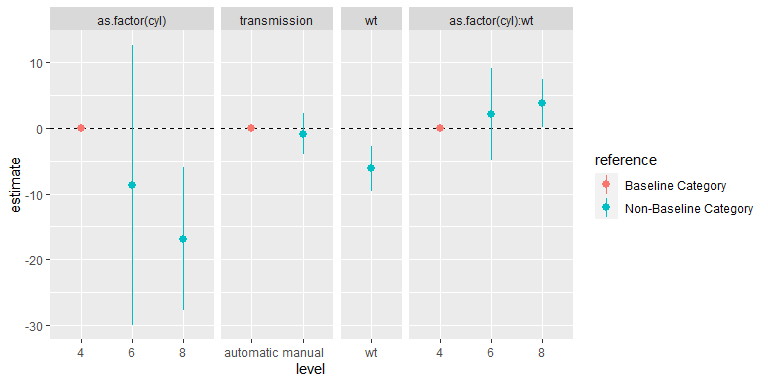

<!-- README.md is generated from README.Rmd. Please edit that file -->


<!-- badges: start -->

<!-- badges: end -->

## Introduction

The `tidycat` package includes the `tidy_categorical()` function to
expand `broom::tidy()` outputs for categorical parameter estimates.

## Documentation

For full documentation, see the package vignette: [The tidycat package:
expand broom::tidy() output for categorical parameter
estimates](https://cran.r-project.org/web/packages/tidycat/vignettes/intro.html)

## Hello World

The `tidy()` function in the broom package takes the messy output of
built-in functions in R, such as `lm()`, and turns them into tidy data
frames.

``` r
library(dplyr)
library(broom)
m1 <- mtcars %>%
  mutate(transmission = recode_factor(am, `0` = "automatic", `1` = "manual")) %>%
  lm(mpg ~ qsec + as.factor(cyl) + wt * transmission , data = .)

tidy(m1)
#> # A tibble: 7 x 5
#>   term                  estimate std.error statistic p.value
#>   <chr>                    <dbl>     <dbl>     <dbl>   <dbl>
#> 1 (Intercept)             10.8       9.24      1.17  0.254  
#> 2 qsec                     0.973     0.454     2.14  0.0419 
#> 3 as.factor(cyl)6         -0.545     1.62     -0.335 0.740  
#> 4 as.factor(cyl)8         -0.364     2.52     -0.144 0.886  
#> 5 wt                      -2.91      0.827    -3.53  0.00166
#> 6 transmissionmanual      13.5       3.94      3.43  0.00210
#> 7 wt:transmissionmanual   -3.97      1.31     -3.03  0.00558
```

The `tidy_categorical()` function adds

  - further columns (`variable`, `level` and `effect`) to the
    `broom::tidy()` output to help manage categorical variables
  - further rows for reference category terms and a column to indicate
    their location (`reference`) when setting `include_reference = TRUE`
    (default)

It requires two inputs

  - a data frame `d` of parameter estimates from a model (from
    `broom::tidy()`)
  - the corresponding model object `m` passed to `broom::tidy()`

For example:

``` r
library(tidycat)
d1 <- m1 %>%
  tidy(conf.int = TRUE) %>%
  tidy_categorical(m = m1)
d1 %>%
  select(-(3:5))
#> # A tibble: 10 x 8
#>    term       estimate conf.low conf.high variable   level  effect  reference   
#>    <chr>         <dbl>    <dbl>     <dbl> <chr>      <fct>  <chr>   <chr>       
#>  1 (Intercep~   10.8    -8.25       29.8  (Intercep~ (Inte~ main    Non-Baselin~
#>  2 qsec          0.973   0.0386      1.91 qsec       qsec   main    Non-Baselin~
#>  3 <NA>          0       0           0    as.factor~ 4      main    Baseline Ca~
#>  4 as.factor~   -0.545  -3.89        2.80 as.factor~ 6      main    Non-Baselin~
#>  5 as.factor~   -0.364  -5.56        4.83 as.factor~ 8      main    Non-Baselin~
#>  6 wt           -2.91   -4.62       -1.21 wt         wt     main    Non-Baselin~
#>  7 <NA>          0       0           0    transmiss~ autom~ main    Baseline Ca~
#>  8 transmiss~   13.5     5.40       21.6  transmiss~ manual main    Non-Baselin~
#>  9 <NA>          0       0           0    wt:transm~ autom~ intera~ Baseline Ca~
#> 10 wt:transm~   -3.97   -6.67       -1.28 wt:transm~ manual intera~ Non-Baselin~
```

The expanded data frame from `tidy_categorical()` of parameter estimates
can be particularly useful for creating coefficient plots, allowing:

  - Grouping terms from the same categorical variable from the
    additional columns.
  - Including reference categories in a coefficient plot from the
    additional rows, allowing the reader to better grasp the meaning of
    the parameter estimates in each categorical variable.

For example:

``` r
library(ggplot2)
library(ggforce)
d1 %>%
  slice(-1) %>%
  ggplot(mapping = aes(x = level, y = estimate, colour = reference,
                       ymin = conf.low, ymax = conf.high)) +
  facet_row(facets = "variable", scales = "free_x", space = "free") +
  geom_hline(yintercept = 0, linetype = "dashed") +
  geom_pointrange()
```

<!-- -->

## Installation

You can install the released version of tidycat from
[CRAN](https://CRAN.R-project.org) with:

``` r
install.packages("tidycat")
```

And the development version from [GitHub](https://github.com/) with:

``` r
# install.packages("devtools")
devtools::install_github("guyabel/tidycat")
```
