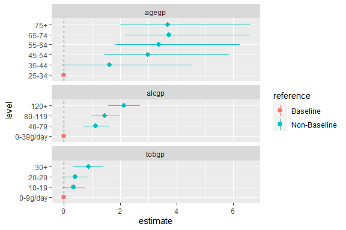
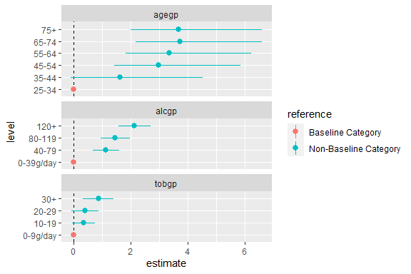
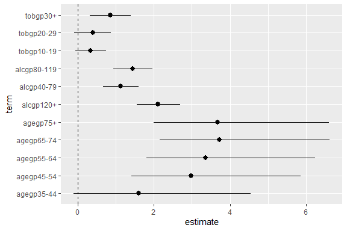
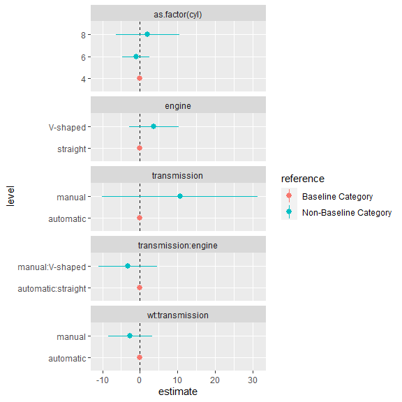
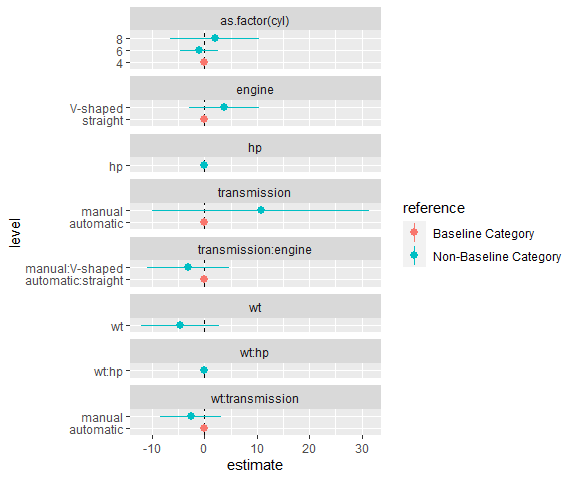

<!-- README.md is generated from README.Rmd. Please edit that file -->

## Introduction

The `tidycat` package includes the `tidy_categorical()` function to
expand `broom::tidy()` outputs for categorical parameter estimates.

<!-- badges: start -->

<!-- badges: end -->

## Installation

You can install the released version of tidycat from
[CRAN](https://CRAN.R-project.org) with:

``` r
install.packages("tidycat")
```

And the development version from [GitHub](https://github.com/) with:

``` r
# install.packages("devtools")
devtools::install_github("guyabel/tidycat")
```

## Additional columns on broom::tidy() for categorical parameter estimates

The `tidy()` function in the broom package takes the messy output of
built-in functions in R, such as `lm()`, and turns them into tidy data
frames.

``` r
library(dplyr)
library(broom)
m0 <- esoph %>%
   mutate_if(is.factor, ~factor(., ordered = FALSE)) %>%
   glm(cbind(ncases, ncontrols) ~ agegp + tobgp + alcgp, data = ., family = binomial())
# tidy
tidy(m0)
#> # A tibble: 12 x 5
#>    term        estimate std.error statistic  p.value
#>    <chr>          <dbl>     <dbl>     <dbl>    <dbl>
#>  1 (Intercept)   -5.91      1.03      -5.74 9.61e- 9
#>  2 agegp35-44     1.61      1.07       1.51 1.32e- 1
#>  3 agegp45-54     2.98      1.02       2.90 3.68e- 3
#>  4 agegp55-64     3.36      1.02       3.29 9.91e- 4
#>  5 agegp65-74     3.73      1.03       3.64 2.78e- 4
#>  6 agegp75+       3.68      1.06       3.46 5.43e- 4
#>  7 tobgp10-19     0.341     0.205      1.66 9.72e- 2
#>  8 tobgp20-29     0.396     0.246      1.61 1.07e- 1
#>  9 tobgp30+       0.868     0.277      3.14 1.70e- 3
#> 10 alcgp40-79     1.12      0.238      4.70 2.55e- 6
#> 11 alcgp80-119    1.45      0.263      5.51 3.68e- 8
#> 12 alcgp120+      2.12      0.288      7.36 1.90e-13
```

Note: Currently ordered factor not supported in `tidycat`, hence their
removal in `mutate_if()` above

The `tidy_categorical()` function adds further columns (`variable`,
`level`, `effect` and `reference`) to the `broom::tidy()` output to help
manage categorical variables

``` r
library(tidycat)
m0 %>%
  tidy() %>%
  tidy_categorical(m = m0, include_reference =  FALSE)
#> # A tibble: 12 x 9
#>    term   estimate std.error statistic  p.value variable  level effect reference
#>    <chr>     <dbl>     <dbl>     <dbl>    <dbl> <chr>     <fct> <chr>  <chr>    
#>  1 (Inte~   -5.91      1.03      -5.74 9.61e- 9 (Interce~ (Int~ main   Non-Base~
#>  2 agegp~    1.61      1.07       1.51 1.32e- 1 agegp     35-44 main   Non-Base~
#>  3 agegp~    2.98      1.02       2.90 3.68e- 3 agegp     45-54 main   Non-Base~
#>  4 agegp~    3.36      1.02       3.29 9.91e- 4 agegp     55-64 main   Non-Base~
#>  5 agegp~    3.73      1.03       3.64 2.78e- 4 agegp     65-74 main   Non-Base~
#>  6 agegp~    3.68      1.06       3.46 5.43e- 4 agegp     75+   main   Non-Base~
#>  7 tobgp~    0.341     0.205      1.66 9.72e- 2 tobgp     10-19 main   Non-Base~
#>  8 tobgp~    0.396     0.246      1.61 1.07e- 1 tobgp     20-29 main   Non-Base~
#>  9 tobgp~    0.868     0.277      3.14 1.70e- 3 tobgp     30+   main   Non-Base~
#> 10 alcgp~    1.12      0.238      4.70 2.55e- 6 alcgp     40-79 main   Non-Base~
#> 11 alcgp~    1.45      0.263      5.51 3.68e- 8 alcgp     80-1~ main   Non-Base~
#> 12 alcgp~    2.12      0.288      7.36 1.90e-13 alcgp     120+  main   Non-Base~
```

Include additional rows for reference category terms and column to
indicate their location by setting `include_reference = TRUE` (default).
Setting `exponentiate = TRUE` ensures the parameter estimates in the
reference group are set to one instead of zero (even odds in the
logistic regression example below).

``` r
m0 %>%
  tidy(exponentiate = TRUE) %>%
  tidy_categorical(m = m0, exponentiate = TRUE, reference_label = "Baseline") %>%
  select(-statistic, -p.value)
#> # A tibble: 15 x 7
#>    term        estimate std.error variable    level       effect reference   
#>    <chr>          <dbl>     <dbl> <chr>       <fct>       <chr>  <chr>       
#>  1 (Intercept)  0.00271     1.03  (Intercept) (Intercept) main   Non-Baseline
#>  2 <NA>         1           1     agegp       25-34       main   Baseline    
#>  3 agegp35-44   5.00        1.07  agegp       35-44       main   Non-Baseline
#>  4 agegp45-54  19.6         1.02  agegp       45-54       main   Non-Baseline
#>  5 agegp55-64  28.7         1.02  agegp       55-64       main   Non-Baseline
#>  6 agegp65-74  41.6         1.03  agegp       65-74       main   Non-Baseline
#>  7 agegp75+    39.7         1.06  agegp       75+         main   Non-Baseline
#>  8 <NA>         1           1     tobgp       0-9g/day    main   Baseline    
#>  9 tobgp10-19   1.41        0.205 tobgp       10-19       main   Non-Baseline
#> 10 tobgp20-29   1.49        0.246 tobgp       20-29       main   Non-Baseline
#> 11 tobgp30+     2.38        0.277 tobgp       30+         main   Non-Baseline
#> 12 <NA>         1           1     alcgp       0-39g/day   main   Baseline    
#> 13 alcgp40-79   3.07        0.238 alcgp       40-79       main   Non-Baseline
#> 14 alcgp80-119  4.25        0.263 alcgp       80-119      main   Non-Baseline
#> 15 alcgp120+    8.29        0.288 alcgp       120+        main   Non-Baseline
```

## Standard coefficient plots

The results from `broom::tidy()` can be used to quickly plot estimated
coefficients and their confidence intervals.

``` r
# store parameter estimates and confidence intervals (except for the intercept)
d0 <- m0 %>%
  tidy(conf.int = TRUE) %>%
  slice(-1)
d0
#> # A tibble: 11 x 7
#>    term        estimate std.error statistic  p.value conf.low conf.high
#>    <chr>          <dbl>     <dbl>     <dbl>    <dbl>    <dbl>     <dbl>
#>  1 agegp35-44     1.61      1.07       1.51 1.32e- 1  -0.100      4.54 
#>  2 agegp45-54     2.98      1.02       2.90 3.68e- 3   1.41       5.86 
#>  3 agegp55-64     3.36      1.02       3.29 9.91e- 4   1.81       6.24 
#>  4 agegp65-74     3.73      1.03       3.64 2.78e- 4   2.16       6.62 
#>  5 agegp75+       3.68      1.06       3.46 5.43e- 4   1.99       6.61 
#>  6 tobgp10-19     0.341     0.205      1.66 9.72e- 2  -0.0644     0.742
#>  7 tobgp20-29     0.396     0.246      1.61 1.07e- 1  -0.0935     0.872
#>  8 tobgp30+       0.868     0.277      3.14 1.70e- 3   0.319      1.41 
#>  9 alcgp40-79     1.12      0.238      4.70 2.55e- 6   0.665      1.60 
#> 10 alcgp80-119    1.45      0.263      5.51 3.68e- 8   0.939      1.97 
#> 11 alcgp120+      2.12      0.288      7.36 1.90e-13   1.56       2.69

library(ggplot2)
library(tidyr)
ggplot(data = d0,
        mapping = aes(x = term, y = estimate, ymin = conf.low, ymax = conf.high)) +
   coord_flip() +
   geom_hline(yintercept = 0, linetype = "dashed") +
   geom_pointrange()
```


## Enhanced coefficient plots

The additional columns from `tidy_categroical()` can be used to group
together terms from the same categorical variable by setting `colour =
variable`

``` r
d0 <- m0 %>%
  tidy(conf.int = TRUE) %>%
  tidy_categorical(m = m0, include_reference = FALSE) %>%
  slice(-1)

d0 %>%
  select(-(3:5))
#> # A tibble: 11 x 8
#>    term      estimate conf.low conf.high variable level  effect reference       
#>    <chr>        <dbl>    <dbl>     <dbl> <chr>    <fct>  <chr>  <chr>           
#>  1 agegp35-~    1.61   -0.100      4.54  agegp    35-44  main   Non-Baseline Ca~
#>  2 agegp45-~    2.98    1.41       5.86  agegp    45-54  main   Non-Baseline Ca~
#>  3 agegp55-~    3.36    1.81       6.24  agegp    55-64  main   Non-Baseline Ca~
#>  4 agegp65-~    3.73    2.16       6.62  agegp    65-74  main   Non-Baseline Ca~
#>  5 agegp75+     3.68    1.99       6.61  agegp    75+    main   Non-Baseline Ca~
#>  6 tobgp10-~    0.341  -0.0644     0.742 tobgp    10-19  main   Non-Baseline Ca~
#>  7 tobgp20-~    0.396  -0.0935     0.872 tobgp    20-29  main   Non-Baseline Ca~
#>  8 tobgp30+     0.868   0.319      1.41  tobgp    30+    main   Non-Baseline Ca~
#>  9 alcgp40-~    1.12    0.665      1.60  alcgp    40-79  main   Non-Baseline Ca~
#> 10 alcgp80-~    1.45    0.939      1.97  alcgp    80-119 main   Non-Baseline Ca~
#> 11 alcgp120+    2.12    1.56       2.69  alcgp    120+   main   Non-Baseline Ca~

ggplot(data = d0,
        mapping = aes(x = term, y = estimate, ymin = conf.low, ymax = conf.high,
                      colour = variable)) +
   coord_flip() +
   geom_hline(yintercept = 0, linetype = "dashed") +
   geom_pointrange()
```



The additional rows from `tidy_categroical()` can be used to include the
reference categories in a coefficient plot, allowing the reader to
better grasp the meaning of the parameter estimates in each categorical
variable. Using `ggforce::facet_col()` the terms of each variable can be
separated to further improve the presentation of the coefficient plot.

``` r
d0 <- m0 %>%
  tidy(conf.int = TRUE) %>%
  tidy_categorical(m = m0) %>%
  slice(-1)

d0 %>%
  select(-(3:5))
#> # A tibble: 14 x 8
#>    term      estimate conf.low conf.high variable level   effect reference      
#>    <chr>        <dbl>    <dbl>     <dbl> <chr>    <fct>   <chr>  <chr>          
#>  1 <NA>         0       0          0     agegp    25-34   main   Baseline Categ~
#>  2 agegp35-~    1.61   -0.100      4.54  agegp    35-44   main   Non-Baseline C~
#>  3 agegp45-~    2.98    1.41       5.86  agegp    45-54   main   Non-Baseline C~
#>  4 agegp55-~    3.36    1.81       6.24  agegp    55-64   main   Non-Baseline C~
#>  5 agegp65-~    3.73    2.16       6.62  agegp    65-74   main   Non-Baseline C~
#>  6 agegp75+     3.68    1.99       6.61  agegp    75+     main   Non-Baseline C~
#>  7 <NA>         0       0          0     tobgp    0-9g/d~ main   Baseline Categ~
#>  8 tobgp10-~    0.341  -0.0644     0.742 tobgp    10-19   main   Non-Baseline C~
#>  9 tobgp20-~    0.396  -0.0935     0.872 tobgp    20-29   main   Non-Baseline C~
#> 10 tobgp30+     0.868   0.319      1.41  tobgp    30+     main   Non-Baseline C~
#> 11 <NA>         0       0          0     alcgp    0-39g/~ main   Baseline Categ~
#> 12 alcgp40-~    1.12    0.665      1.60  alcgp    40-79   main   Non-Baseline C~
#> 13 alcgp80-~    1.45    0.939      1.97  alcgp    80-119  main   Non-Baseline C~
#> 14 alcgp120+    2.12    1.56       2.69  alcgp    120+    main   Non-Baseline C~

library(ggforce)
ggplot(data = d0,
        mapping = aes(x = level, y = estimate, colour = reference,
                      ymin = conf.low, ymax = conf.high)) +
   facet_col(facets = vars(variable), scales = "free_y", space = "free") +
   coord_flip() +
   geom_hline(yintercept = 0, linetype = "dashed") +
   geom_pointrange()
```



Note the switch of the `x` aesthetic to the `level` column rather than
`term`.

Alternatively, horizontal plots can be obtained using
`ggforce::facet_row()` and loosing `coord_flip()`;

``` r
ggplot(data = d0,
      mapping = aes(x = level, y = estimate,
                    ymin = conf.low, ymax = conf.high,
                    colour = reference)) +
 facet_row(facets = vars(variable), scales = "free_x", space = "free") +
 geom_hline(yintercept = 0, linetype = "dashed") +
 geom_pointrange() +
 theme(axis.text.x = element_text(angle = 45, hjust = 1))
```



## Interactions

Models with interactions can also be handled in `tidy_categorical()`.
Using the `mtcars` data we can create three types of interactions
(between two numeric variables, between a numeric variable and
categorical variable and between two categorical variables)

``` r
m1 <- mtcars %>%
  mutate(engine = recode_factor(vs, `0` = "straight", `1` = "V-shaped"),
         transmission = recode_factor(am, `0` = "automatic", `1` = "manual")) %>%
  lm(mpg ~ as.factor(cyl) + wt * hp + wt * transmission + engine * transmission , data = .)

tidy(m1)
#> # A tibble: 10 x 5
#>    term                              estimate std.error statistic p.value
#>    <chr>                                <dbl>     <dbl>     <dbl>   <dbl>
#>  1 (Intercept)                        35.5      12.3        2.89  0.00843
#>  2 as.factor(cyl)6                    -1.03      1.76      -0.585 0.565  
#>  3 as.factor(cyl)8                     2.01      4.09       0.492 0.628  
#>  4 wt                                 -4.65      3.55      -1.31  0.203  
#>  5 hp                                 -0.0731    0.0577    -1.27  0.218  
#>  6 transmissionmanual                 10.7      10.0        1.07  0.296  
#>  7 engineV-shaped                      3.74      3.21       1.16  0.257  
#>  8 wt:hp                               0.0134    0.0162     0.828 0.416  
#>  9 wt:transmissionmanual              -2.63      2.83      -0.930 0.362  
#> 10 transmissionmanual:engineV-shaped  -3.16      3.76      -0.842 0.409
```

Setting `n_level = TRUE` creates an additional column to monitor the
number of observations in each of level of the categorical variables,
including interaction terms in the model:

``` r
d1 <- m1 %>%
  tidy(conf.int = TRUE) %>%
  tidy_categorical(m = m1, n_level = TRUE) %>%
  slice(-1)

d1 %>%
  select(-(2:7))
#> # A tibble: 16 x 6
#>    term               variable       level       effect   reference      n_level
#>    <chr>              <chr>          <fct>       <chr>    <chr>            <dbl>
#>  1 <NA>               as.factor(cyl) 4           main     Baseline Cate~      11
#>  2 as.factor(cyl)6    as.factor(cyl) 6           main     Non-Baseline ~       7
#>  3 as.factor(cyl)8    as.factor(cyl) 8           main     Non-Baseline ~      14
#>  4 wt                 wt             wt          main     Non-Baseline ~      NA
#>  5 hp                 hp             hp          main     Non-Baseline ~      NA
#>  6 <NA>               transmission   automatic   main     Baseline Cate~      19
#>  7 transmissionmanual transmission   manual      main     Non-Baseline ~      13
#>  8 <NA>               engine         straight    main     Baseline Cate~      18
#>  9 engineV-shaped     engine         V-shaped    main     Non-Baseline ~      14
#> 10 wt:hp              wt:hp          wt:hp       interac~ Non-Baseline ~      NA
#> 11 <NA>               wt:transmissi~ automatic   interac~ Baseline Cate~      19
#> 12 wt:transmissionma~ wt:transmissi~ manual      interac~ Non-Baseline ~      13
#> 13 <NA>               transmission:~ automatic:~ interac~ Baseline Cate~      25
#> 14 <NA>               transmission:~ manual:str~ interac~ Non-Baseline ~       0
#> 15 <NA>               transmission:~ automatic:~ interac~ Non-Baseline ~       0
#> 16 transmissionmanua~ transmission:~ manual:V-s~ interac~ Non-Baseline ~       7
```

We can use similar plotting code as above to plot the interactions:

``` r
ggplot(data = d1,
        mapping = aes(x = level, y = estimate, colour = reference,
                      ymin = conf.low, ymax = conf.high)) +
   facet_col(facets = vars(variable), scales = "free_y", space = "free") +
   coord_flip() +
   geom_hline(yintercept = 0, linetype = "dashed") +
   geom_pointrange()
```



The empty levels can be dropped by filtering on the `n_level` column for
categories with more than zero observations and not `NA` in term column.

``` r
ggplot(data = d1 %>% 
         filter(n_level > 0 | !is.na(term)),
        mapping = aes(x = level, y = estimate, colour = reference,
                      ymin = conf.low, ymax = conf.high)) +
   facet_col(facets = vars(variable), scales = "free_y", space = "free") +
   coord_flip() +
   geom_hline(yintercept = 0, linetype = "dashed") +
   geom_pointrange()
```



    #> [1] TRUE
